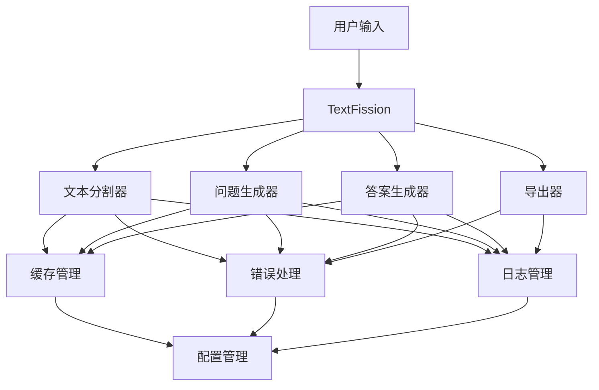
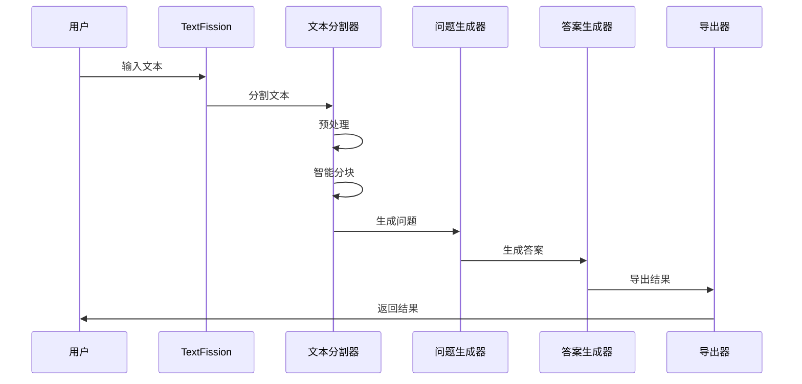
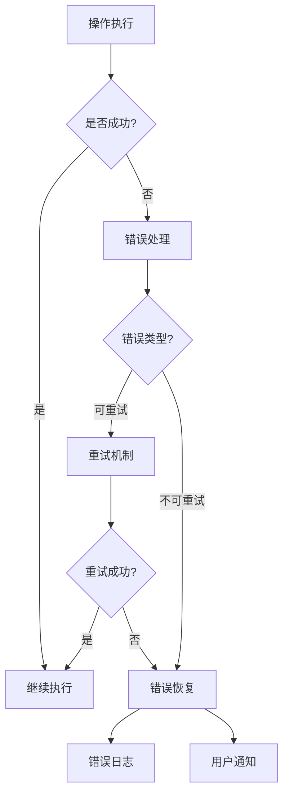
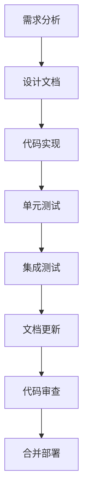
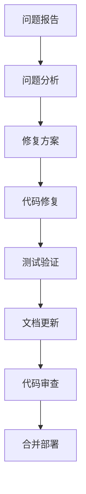
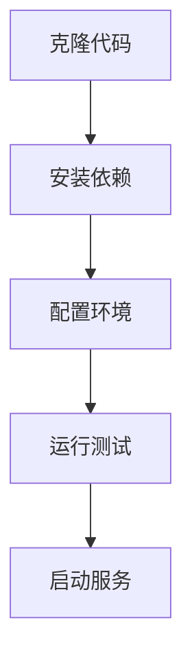
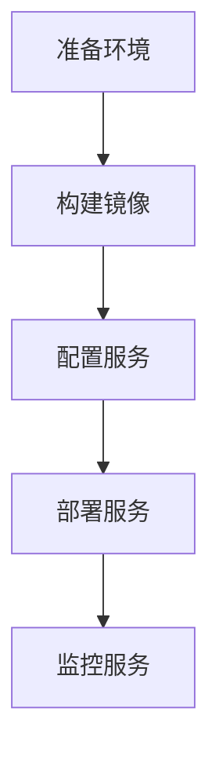

# TextFission 项目流程图

## 1. 系统架构图

## 2. 核心功能流程图

### 2.1 文本处理流程

### 2.2 错误处理流程

## 3. 开发流程

### 3.1 新功能开发流程

### 3.2 问题修复流程

## 4. 定制化开发指南

### 4.1 添加新语言支持

1. 在 `textfission/processors/language` 目录下创建新的语言处理器
2. 实现必要的语言特定处理方法
3. 更新语言检测和选择逻辑
4. 添加相应的单元测试
5. 更新文档

### 4.2 添加新的问题类型

1. 在 `textfission/generators/question` 目录下创建新的问题类型
2. 实现问题生成逻辑
3. 更新问题类型选择逻辑
4. 添加相应的单元测试
5. 更新文档

### 4.3 添加新的导出格式

1. 在 `textfission/exporters` 目录下创建新的导出器
2. 实现导出逻辑
3. 更新导出格式选择逻辑
4. 添加相应的单元测试
5. 更新文档

## 5. 性能优化指南

### 5.1 缓存优化

1. 使用多级缓存
2. 实现缓存预热
3. 优化缓存策略
4. 监控缓存性能

### 5.2 并行处理优化

1. 使用线程池
2. 实现批处理
3. 优化资源使用
4. 监控处理性能

### 5.3 内存优化

1. 实现内存池
2. 优化数据结构
3. 及时释放资源
4. 监控内存使用

## 6. 部署流程

### 6.1 开发环境部署

### 6.2 生产环境部署

## 7. 监控和维护

### 7.1 系统监控

1. 性能监控
   - CPU使用率
   - 内存使用率
   - 响应时间
   - 错误率

2. 业务监控
   - 处理量
   - 成功率
   - 用户反馈
   - 系统告警

### 7.2 系统维护

1. 日常维护
   - 日志清理
   - 缓存清理
   - 性能优化
   - 安全更新

2. 故障处理
   - 问题诊断
   - 快速修复
   - 事后分析
   - 预防措施

## 8. 贡献指南

### 8.1 代码贡献

1. Fork项目
2. 创建特性分支
3. 提交更改
4. 推送到分支
5. 创建Pull Request

### 8.2 文档贡献

1. 更新文档
2. 添加示例
3. 修正错误
4. 改进说明

### 8.3 问题报告

1. 使用问题模板
2. 提供详细信息
3. 复现步骤
4. 期望结果 